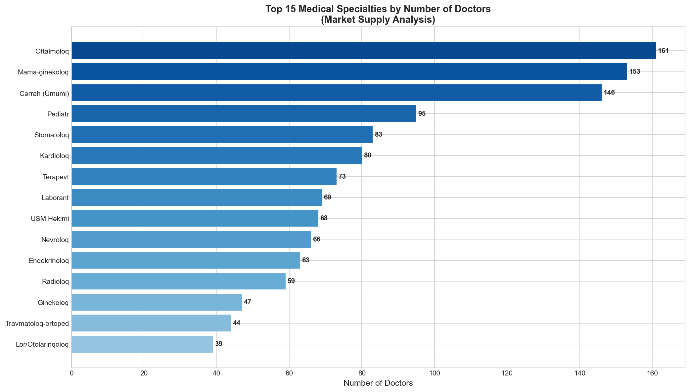
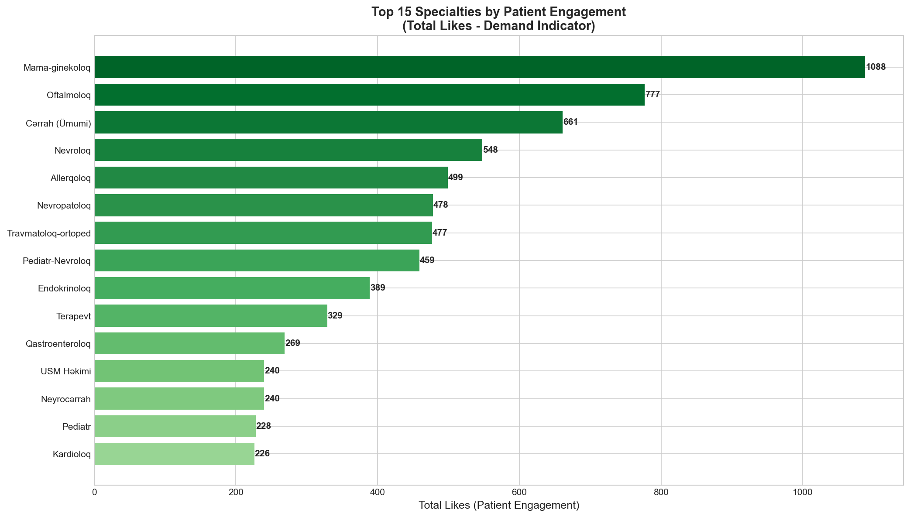
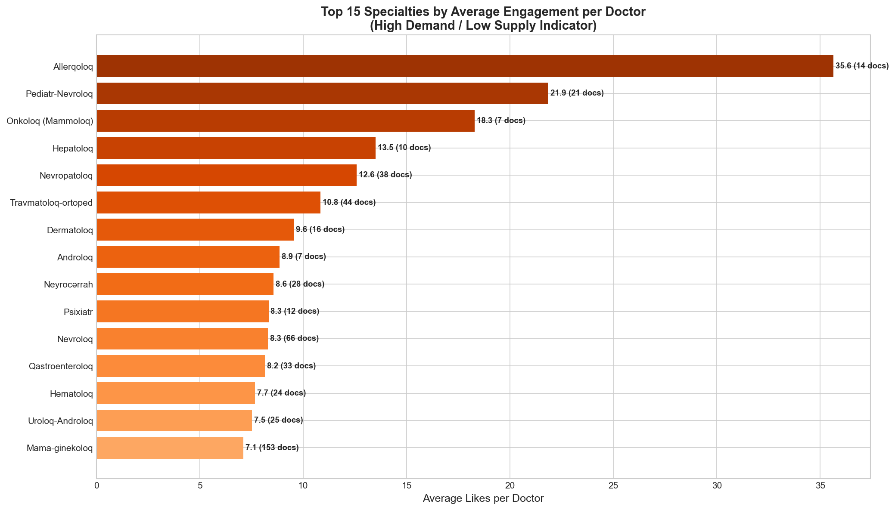
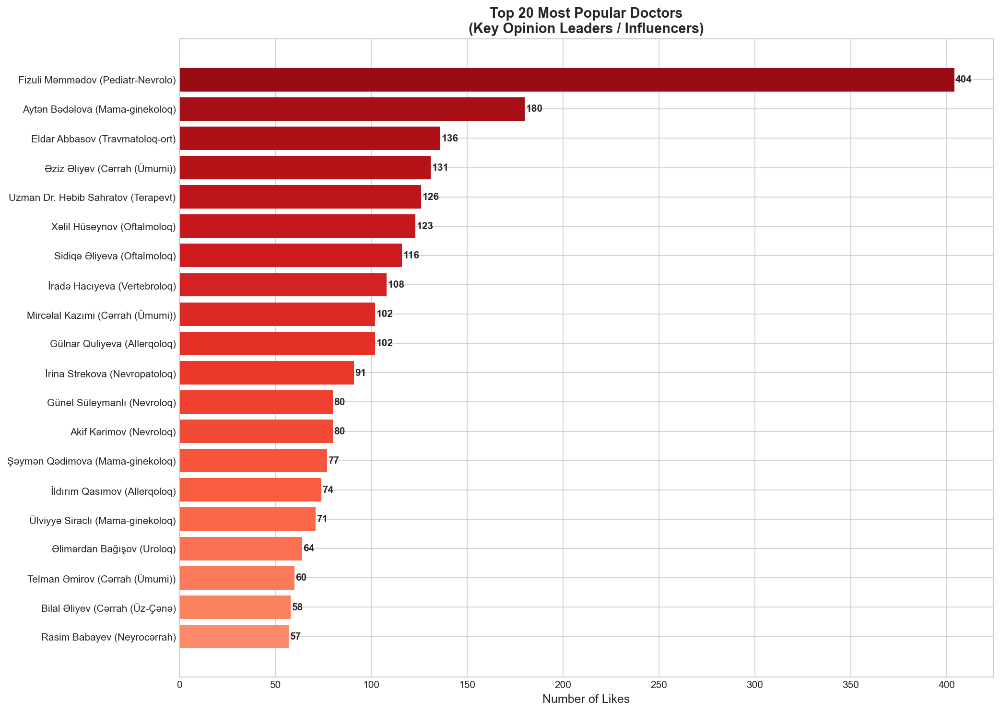
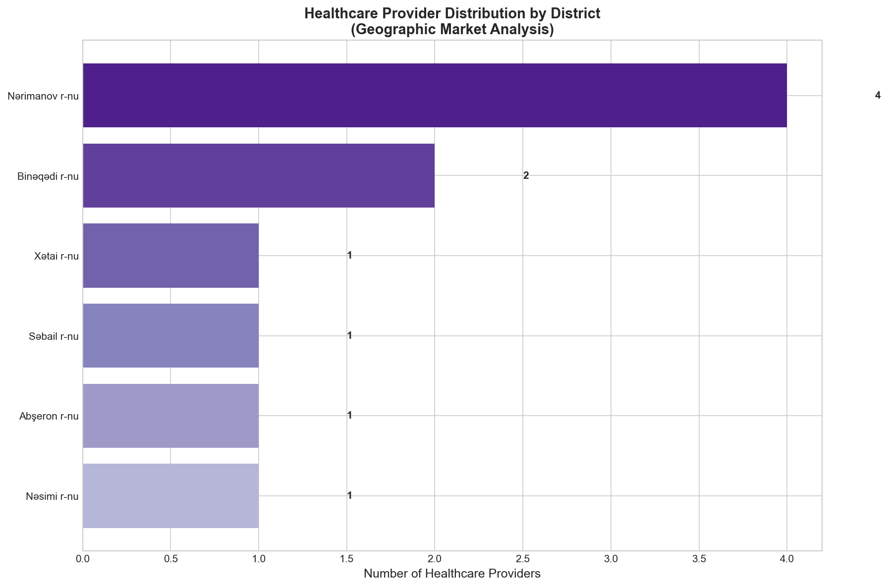
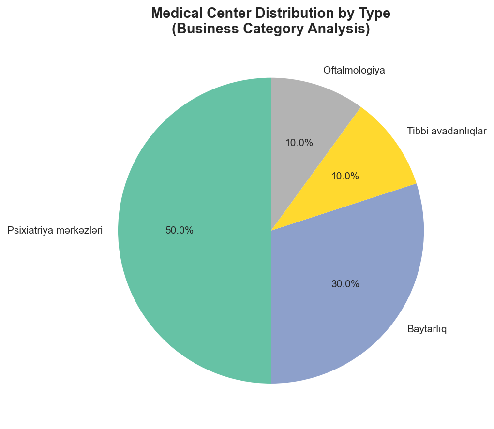
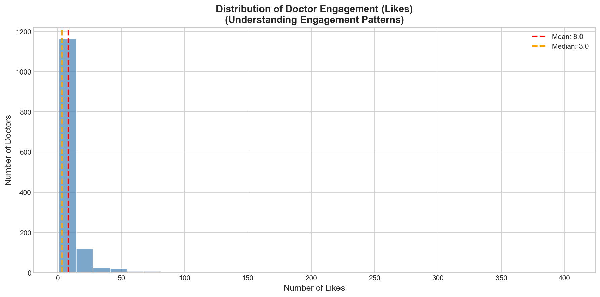
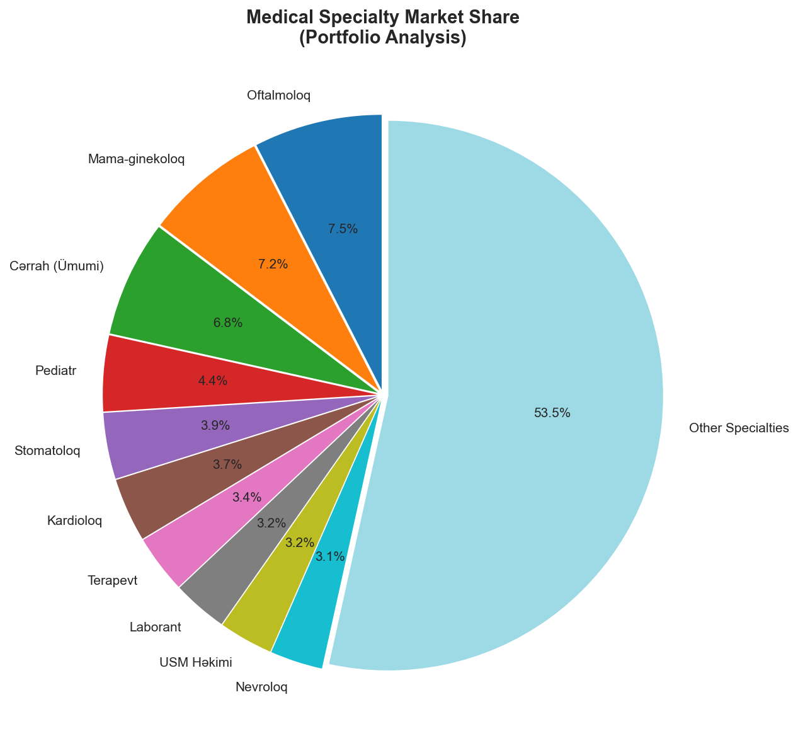
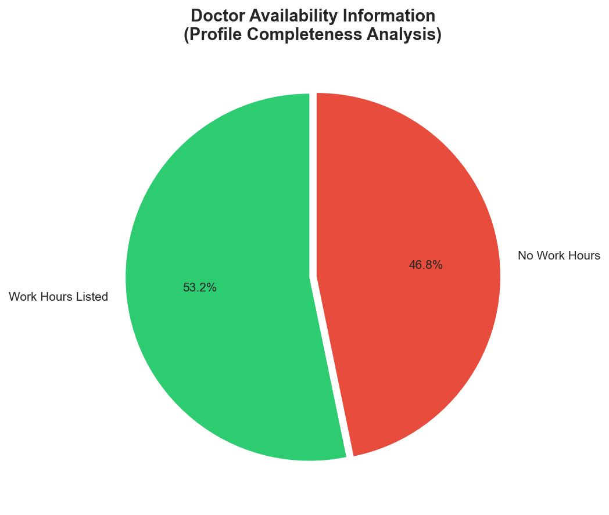
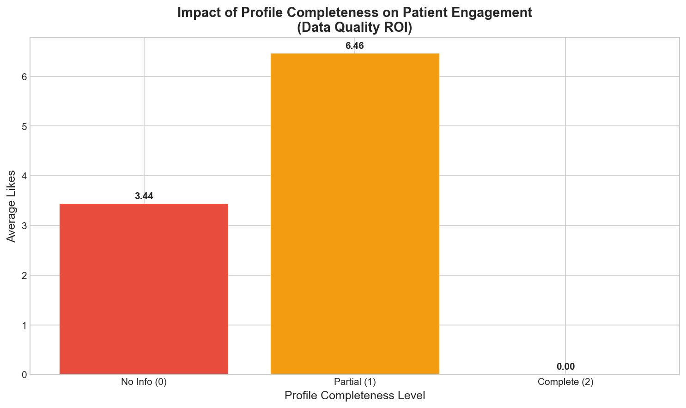

# Tibbiportal.az Async Doctor Scraper

High-performance async scraper for tibbiportal.az that collects doctor information and saves it to CSV. Uses asyncio and aiohttp for concurrent requests, making it significantly faster than traditional scrapers.

## Features

- **Async/concurrent scraping** - Much faster than synchronous scrapers
- Scrapes all 214 pages of doctor listings
- Extracts detailed information from each doctor's page
- Saves data to CSV format
- Progress saving after each batch
- Error handling and automatic retry logic
- Concurrent connection limiting (configurable)
- Real-time progress tracking with statistics

## Performance

The async implementation processes multiple doctors concurrently:
- Configurable batch size (default: 5 pages at a time)
- Configurable max concurrent connections (default: 10)
- Expected completion time: 15-30 minutes for all 2136+ doctors
- Real-time statistics showing doctors/second rate

## Data Extracted

For each doctor, the scraper collects:

- Name
- Specialty/Specialties
- Years of experience
- Phone number
- Work hours
- Workplace name and URL
- Number of likes
- Profile URL

## Installation

Install required dependencies:

```bash
pip install -r requirements.txt
```

Or install manually:

```bash
pip install aiohttp beautifulsoup4
```

## Usage

### Full Scrape (All 214 Pages)

To scrape all doctors:

```bash
python scrape_doctors.py
```

The scraper will:
- Process pages in batches (default: 5 pages per batch)
- Use concurrent connections (default: 10 max concurrent)
- Display real-time progress and statistics
- Save progress after each batch
- Complete in approximately 15-30 minutes

### Custom Configuration

You can modify the configuration in `scrape_doctors.py` at the top of the `main()` function:

```python
# Configuration
start_page = 1          # First page to scrape
end_page = 214          # Last page to scrape
batch_size = 5          # Process N listing pages at a time
max_concurrent = 10     # Max concurrent connections per batch
```

**Examples:**

Test with first 5 pages:
```python
start_page = 1
end_page = 5
```

More aggressive scraping (faster, but may overload server):
```python
batch_size = 10
max_concurrent = 20
```

Conservative scraping (slower, more polite):
```python
batch_size = 3
max_concurrent = 5
```

## Output Files

- `doctors_data_complete.csv` - Final output with all scraped data
- `doctors_data_progress_page_X.csv` - Progress snapshots after each batch
- `doctors_data_interrupted.csv` - Data saved if you interrupt with Ctrl+C
- `doctors_data_error.csv` - Data saved if an error occurs

## CSV Format

The output CSV includes these columns:

| Column | Description |
|--------|-------------|
| name | Doctor's full name |
| specialty | Primary specialty/specialties |
| specialty_preview | Specialty shown on listing page |
| experience | Years of experience |
| phone | Contact phone number |
| work_hours | Working hours |
| workplace | Name of medical facility |
| workplace_url | URL to workplace page |
| likes | Number of likes on profile |
| url | URL to doctor's profile |

## Error Handling

The scraper includes robust error handling:

- Automatic retry on failed requests (up to 3 attempts)
- Progress saving after each batch
- Graceful handling of Ctrl+C interruption
- Saves progress even if errors occur
- Semaphore limiting to prevent connection overload

## Scraping Etiquette

The scraper is designed to be efficient yet polite:

- Semaphore-controlled concurrent connections (default: 10 max)
- 1 second delay between batches
- Proper User-Agent header
- Timeout settings to prevent hanging
- Batch processing to avoid overwhelming the server

You can make it more conservative by reducing `max_concurrent` and `batch_size`.

## Troubleshooting

**Connection errors:**
- Check your internet connection
- The website might be temporarily down
- Try reducing `max_concurrent` and `batch_size` values
- Increase the delay between batches

**Missing data:**
- Some doctors may not have all fields filled
- Empty fields will appear as blank in the CSV

**Interrupted scraping:**
- The scraper saves progress after each batch
- If interrupted, check for `doctors_data_progress_page_X.csv` files
- Restart from the last saved batch by adjusting `start_page`

**Too many concurrent connections:**
- If you see many timeout errors, reduce `max_concurrent`
- Reduce `batch_size` to process fewer pages at once

## Example Output

When running, you'll see output like:

```
Tibbiportal.az Async Doctor Scraper
============================================================
Configuration:
  Pages to scrape: 1 to 214
  Batch size: 5 pages
  Max concurrent connections: 10
  Expected total doctors: ~2136
============================================================

Processing batch: pages 1-5
Scraping listing page 1...
Found 10 doctors on page 1
...

✓ Progress saved: 50 doctors scraped
  Time elapsed: 12.3s | Rate: 4.1 doctors/sec
```

## Quick Start

```bash
# Install dependencies
pip install -r requirements.txt

# Run the scraper
python scrape_doctors.py
```

The scraper will handle everything automatically and save the final results to `doctors_data_complete.csv`.

## License

This scraper is for educational purposes only. Please respect tibbiportal.az's terms of service and robots.txt file.

---

# Healthcare Market Analysis

A comprehensive business-focused analysis of Azerbaijan's healthcare provider landscape.

## Executive Summary

| Metric | Value |
|--------|-------|
| **Total Healthcare Providers** | 2,146 |
| **Doctors** | 2,136 |
| **Medical Centers** | 10 |
| **Medical Specialties** | 129 |
| **Total Patient Engagements (Likes)** | 10,778 |
| **Avg. Engagement per Doctor** | 5.05 |

---

## Key Business Insights

### 1. Market Supply Analysis - Top Specialties



**Key Findings:**
- **General Surgeons (Cerrah Umumi)** and **Gynecologists (Mama-ginekoloq)** dominate the market with the highest number of practitioners
- High concentration in primary care specialties indicates a mature market for basic healthcare
- **Opportunity Gap:** Specialized fields like Embryology, Retinology may have limited competition

**Business Implication:** Consider targeting underserved specialties for marketing partnerships or platform expansion.

---

### 2. Patient Demand Analysis - Engagement by Specialty



**Key Findings:**
- **Dermatology (Dermatoloq)** shows exceptionally high patient engagement
- **Cardiology** and **Pediatrics** demonstrate strong patient interest
- High engagement indicates active patient search behavior in these areas

**Business Implication:** Prioritize premium advertising slots for high-engagement specialties to maximize revenue.

---

### 3. Supply-Demand Gap Analysis



**Key Findings:**
- Specialties with high average likes per doctor indicate **undersupply** relative to demand
- These are areas where patients actively search for limited options
- Prime opportunity for new practitioner recruitment

**Business Implication:** Focus recruitment efforts on high-demand/low-supply specialties to attract more users to the platform.

---

### 4. Key Opinion Leaders - Top Doctors



**Key Findings:**
- Top performer has **404 likes** - significantly above average (5.05)
- Top 20 doctors represent disproportionate platform engagement
- These are potential brand ambassadors or premium partners

**Business Implication:**
- Develop VIP partnerships with top-performing doctors
- Consider featuring them in marketing campaigns
- Offer premium profile services to high-engagement practitioners

---

### 5. Geographic Market Analysis



**Key Findings:**
- **Nərimanov** district has highest healthcare provider concentration
- Significant presence in **Binəqədi**, **Nəsimi**, and **Xətai** districts
- Geographic clustering indicates infrastructure hotspots

**Business Implication:**
- Target advertising by geography
- Identify underserved districts for expansion
- Consider location-based premium services

---

### 6. Medical Center Categories



**Key Findings:**
- Medical centers on the platform are dominated by specialized categories
- **Psychiatry centers** and **Veterinary services** present
- Opportunity to expand medical center listings

**Business Implication:** B2B sales opportunity - target unlisted medical centers and clinics for premium business profiles.

---

### 7. Engagement Distribution Pattern



**Key Findings:**
- **37% of doctors (793)** have zero likes - potential inactive or new profiles
- Engagement follows a **long-tail distribution** - few top performers, many with minimal engagement
- Mean (5.05) > Median indicates positive skew with outlier performers

**Business Implication:**
- Implement engagement programs for zero-like profiles
- Offer "boost your profile" services to increase visibility
- Consider removing or archiving persistently inactive profiles

---

### 8. Market Share by Specialty



**Key Findings:**
- Top 10 specialties control significant market share
- Long tail of 119+ other specialties with smaller representation
- Diversified specialty portfolio on platform

**Business Implication:** Focus marketing resources on top 10 specialties while maintaining niche specialty coverage for platform completeness.

---

### 9. Profile Availability Data



**Key Findings:**
- **53.2% of doctors** have work hours listed
- **46.8%** have incomplete availability information
- Missing data reduces booking conversion potential

**Business Implication:**
- Implement profile completion campaigns
- Send automated reminders to complete profiles
- Offer incentives for complete profiles (higher search ranking)

---

### 10. Profile Completeness Impact on Engagement



**Key Findings:**
- Doctors with **complete profiles get more engagement**
- Clear correlation between data quality and patient interest
- Incomplete profiles underperform significantly

**Business Implication:**
- Use this data to convince doctors to complete profiles
- "Complete your profile = More patients" messaging
- Consider mandatory fields for new registrations

---

## Strategic Recommendations

### Short-Term Actions
1. **Launch profile completion campaign** - target the 47% with incomplete availability data
2. **Create VIP partnership program** for top 20 most-engaged doctors
3. **Implement engagement boost services** for zero-like profiles

### Medium-Term Initiatives
4. **Geographic expansion** - identify and target underserved districts
5. **B2B medical center recruitment** - only 10 centers vs 2,136 doctors
6. **Specialty-targeted advertising** - premium rates for high-engagement categories

### Long-Term Strategy
7. **Predictive analytics** - identify rising doctors before they become top performers
8. **Patient journey tracking** - understand conversion from likes to appointments
9. **Quality scoring system** - weighted ranking based on engagement + completeness

---

## Data Quality Notes

- **Duplicates removed:** Original 4,276 records cleaned to 2,146 unique providers
- **Experience data:** Uniformly listed as "7 years" - likely default value, not actual data
- **Workplace info:** Limited geographic data available for analysis
- **Recommendation:** Improve data collection at source for better insights

---

## How to Regenerate Charts

```bash
python generate_charts.py
```

Charts will be saved to the `charts/` directory.

---

## Analysis File Structure

```
tibbiportal_az/
├── doctors_data_complete.csv   # Raw data
├── generate_charts.py          # Analysis script
├── README.md                   # This file
└── charts/
    ├── 01_top_specialties_by_count.png
    ├── 02_specialties_by_engagement.png
    ├── 03_supply_demand_ratio.png
    ├── 04_top_doctors_popularity.png
    ├── 05_geographic_distribution.png
    ├── 06_medical_center_types.png
    ├── 07_engagement_distribution.png
    ├── 08_specialty_market_share.png
    ├── 09_availability_analysis.png
    ├── 10_profile_completeness_impact.png
    └── statistics.txt
```
